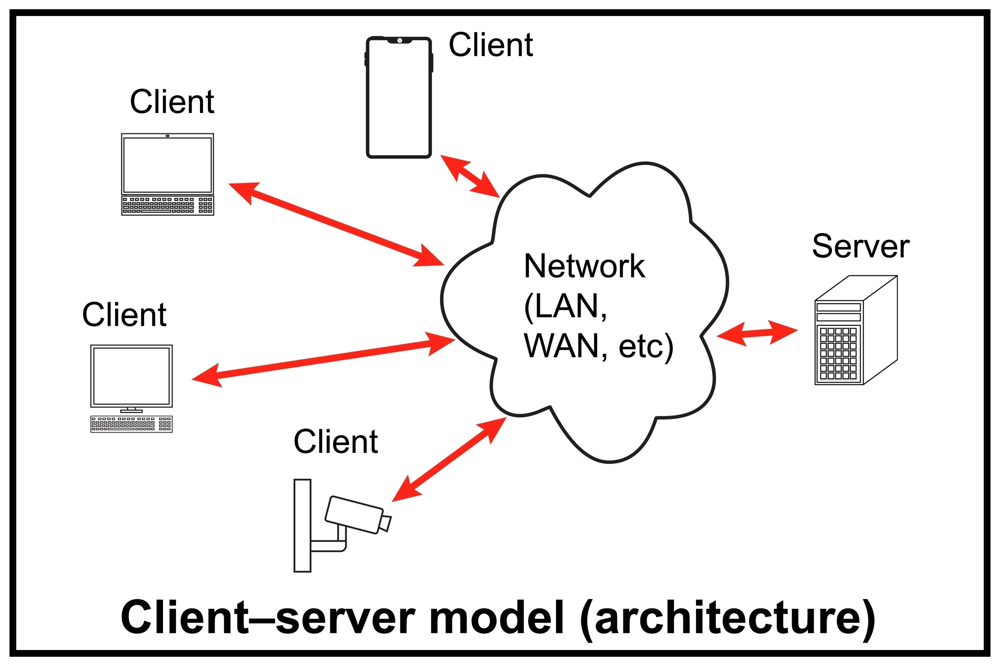

## Objectives

- Introduction to Backend Development
- Overview of the Django Framework
- Understanding Django’s Project Structure and Philosophy
- Creating Our First Django Project and Application

## What is Backend Development?
When we browse a website, book a flight, or use a mobile app, our interaction is with the **front-end**. We see the buttons, the text, and the images beautifully arranged on our screen. This is the visual part of the application, often called the client-side. But have you ever wondered what happens when you click that "Login" button or "Buy Now"? 

 

Behind the scenes, there's a whole other world working tirelessly to make that experience possible. This is the **backend**, also known as the server-side. It's the engine of the application, the part that you don't see but that does all the heavy lifting.
Backend development is the work that goes on behind this curtain. It's responsible for everything the user doesn't directly interact with, but that is crucial for the application to function. These responsibilities include:
- **Storing and Managing Data:** When you create a user account, upload a photo, or write a blog post, the backend takes that information and securely saves it in a database. It also retrieves this data whenever it's needed.
- **Handling Business Logic:** The backend is the brain of the operation. It processes user requests, performs complex calculations, and enforces the rules of the application. For example, when you try to log in, it's the backend that checks if your username and password are correct. When you buy a product, it processes the payment and updates the inventory.
- **Communicating with the Front-End:** The backend has a constant conversation with the front-end. It receives requests from your browser (the client) and sends back the data needed to display the webpage or confirm an action.
- **Authentication and Security:** A critical role of the backend is to keep everything secure. It manages user logins, controls who has access to what information, and protects sensitive data from unauthorized access.


Essentially, if the front-end is the part of the restaurant where you sit, read the menu, and eat your meal, the backend is the entire kitchen. It's where the ingredients are stored, the chefs prepare the food, and everything is made ready to serve.
## Overview of the Django Framework
### First, What is a Framework?
Building a complex web backend from scratch is like crafting a car by forging every nut and bolt yourself it’s doable, but incredibly time-consuming and error-prone. Instead of reinventing the wheel, developers use a **framework**. A framework is a collection of pre-written code, tools, and conventions that provides a foundation for building software applications. Think of it as a toolkit and a blueprint rolled into one. It handles repetitive tasks like routing web requests, managing databases, and securing user sessions, freeing developers to focus on creating the unique features of their application.
### What is Django and How Does It Help Us?
**Django** is a high-level Python web framework designed for rapid development and clean, pragmatic design. Born in a fast-paced newsroom environment, Django was built to power complex, database-driven websites with tight deadlines. Its primary goal is to simplify the repetitive, low-level tasks of web development like handling HTTP requests, database interactions, and user authentication so developers can focus on building their application’s unique functionality without starting from scratch.
### Batteries-Included and Opinionated
Django is often described with two key phrases:
1. **"Batteries-Included"**: Django comes packed with nearly everything you need to build a web application right out of the box. It includes tools for user authentication (e.g., login systems), an admin interface (a ready-to-use dashboard for managing your site), an Object-Relational Mapper (ORM) for seamless database interactions, and features like form handling and security protections. This eliminates the need to hunt for and integrate third-party libraries for common tasks, saving time and effort.
2. **"Opinionated"**: Django has a clear philosophy about the “right way” to build web applications. It enforces a specific project structure and design patterns, like its Model-View-Template (MVT) architecture. While this might feel restrictive to some, it ensures consistent, maintainable, and secure code. A developer familiar with Django can jump into any Django project and quickly understand its structure, making collaboration and maintenance easier.
### Who Uses Django?
Django isn’t just for small projects it’s a powerful framework trusted by major organizations to handle high-traffic, complex applications. Some notable examples include:
- **Instagram**: The social media giant uses Django to manage its massive user base and dynamic content.
- **Spotify**: The music streaming service leverages Django for parts of its backend, handling tasks like data processing and API services.
- **Pinterest**: This visual discovery platform relies on Django to organize and serve millions of images and user interactions.
- **NASA**: The official NASA website uses Django for its content management system, ensuring reliable delivery of mission-critical information.
## Django’s Project Structure and Philosophy
Now that we understand what Django is and why it’s so popular, let’s take a closer look at **how Django organizes a project** and the **philosophy** behind that structure.
### The MVC Pattern
Before exploring Django’s structure, it’s helpful to understand a widely used software design principle called **MVC**, or **Model-View-Controller**. This pattern organizes an application into three interconnected components, each with a specific role:
#### Model: 
The model represents the data and the rules for managing it. It defines the structure of your database (e.g., tables and relationships) and handles how data is stored, retrieved, and updated. _Example_: A User model might define fields like username, email, and password, along with logic for validating or querying that data.
#### View: 
The view is the user interfacewhat users see and interact with. It’s responsible for displaying data from the models, typically as HTML pages, but it could also be JSON or other formats for APIs. _Example_: A view might display a user’s profile page with their name and email.
#### Controller: 
The controller acts as the glue between the model and view. It processes user input (like form submissions or button clicks), interacts with the model to fetch or update data, and determines which view to render next. _Example_: When a user submits a login form, the controller validates the credentials and directs them to the appropriate page.

The MVC pattern keeps your code modular, testable, and easier to maintain by ensuring each component has a single, well-defined responsibility.
### Django’s MVT Architecture
Django uses a variation of MVC called **MVT**, or **Model-View-Template**. While the core idea is similar to MVC, Django’s approach is tailored to web development and simplifies certain aspects by handling some of the “controller” logic automatically. Here’s how MVT breaks down:
#### Model: 
Just like in MVC, the model defines the data structure and manages database interactions. Django’s models are Python classes that map to database tables, using an Object-Relational Mapping (ORM) system to simplify database operations. _Example_: A BlogPost model might have fields like title, content, and publish_date.
#### View: 
In Django, the view is a Python function or class that contains the business logic. It retrieves data from models, processes user input, and decides which template to render or what data to return (e.g., for an API). Unlike MVC’s view, Django’s view doesn’t handle the presentation itself—it delegates that to templates. _Example_: A view might fetch all blog posts from the database and pass them to a template for display.
#### Template: 
The template is responsible for the presentation layer, typically HTML files with embedded Python-like syntax (Django’s template language). Templates define how data from the view is displayed to the user. _Example_: A template might loop through a list of blog posts to create a webpage with their titles and summaries.

In MVT, the controller role is largely handled by Django’s framework itself, specifically through its **URL dispatcher**. The URL dispatcher maps incoming web requests (e.g., visiting /blog/) to the appropriate view, eliminating the need for you to write low-level routing logic. This automation lets developers focus on building the application’s core functionality models, views, and templates while Django handles the plumbing.
### Django’s Project Structure
Django organizes projects in a structured, modular way to keep code organized and scalable. When we create a new Django project, it generates a specific set of files and folders, each with a clear purpose. This structure, combined with Django’s philosophy of breaking projects into reusable **apps**, makes it easy to manage complex applications and collaborate with other developers.
#### Creating a Django Project
To start a new Django project, you use the django-admin command-line tool. Assuming you have Django installed (via pip install django), you can create a project by running:

```bash
django-admin startproject myproject
```
This command creates a folder named myproject (you can choose any name) with the following structure:
```
myproject/
├── manage.py
└── myproject/
    ├── __init__.py
    ├── asgi.py
    ├── settings.py
    ├── urls.py
    └── wsgi.py
```
Let’s break down these files and their roles:
#### manage.py: 
A command-line utility for interacting with our Django project. We use it to run the development server (python manage.py runserver), create database tables (python manage.py migrate), or perform other administrative tasks. We can Think of it as our project’s control panel.
#### myproject/: 
A subdirectory with the same name as your project, containing the core configuration files.
#### \_\_init\_\_.py: 
An empty file that tells Python this directory is a package, allowing us to import its contents.
#### settings.py: 
The heart of our project’s configuration. It defines settings like the database connection (e.g., SQLite, PostgreSQL), installed apps, middleware, templates, and security settings (e.g., our app’s secret key). we will tweak this file often to customize our project.
#### urls.py: 
The URL dispatcher. This file maps URLs (e.g., /about/) to views, directing incoming requests to the right place in our application. It’s like a traffic controller for your website.   
#### asgi.py and wsgi.py: 
These files define how our project interfaces with web servers. wsgi.py is used for traditional web server deployments, while asgi.py supports asynchronous features (e.g., for real-time apps like chat systems). We rarely need to edit these.  

This structure keeps our project’s core configuration separate from its functionality, making it easy to manage and scale.
### Django’s App-Based Structure
Django encourages breaking a project into smaller, reusable components called **apps**. An app is a self-contained module that handles a specific piece of functionality, like a blog, a user authentication system, or an e-commerce store. Each app can have its own models, views, templates, and URLs, making it portable and reusable across projects.    
For example, a website might have one app for a blog, another for user profiles, and a third for a contact form. This modular approach makes our codebase easier to maintain, test, and scale. If we want to reuse our blog app in another project, we can simply copy it over and plug it in.  

To create an app within our project, we navigate to the project’s root directory (where manage.py is) and run:
```bash
python manage.py startapp myapp
```
This creates a new folder named myapp (you can choose any name) with the following structure:
```
myapp/
├── __init__.py
├── admin.py
├── apps.py
├── migrations/
│   └── __init__.py
├── models.py
├── tests.py
├── urls.py
└── views.py
```
Here’s what each file does:
#### \_\_init\_\_.py: 
Marks the directory as a Python package, just like in the project structure.
#### admin.py: 
Configures the Django admin interface for our app. We register models here to manage them via the admin dashboard (e.g., adding or editing blog posts).
#### apps.py: 
Defines the app’s configuration, such as its name. Django uses this to recognize the app when we add it to ``INSTALLED_APPS`` in settings.py.
#### migrations/: 
A folder that stores database migration files. These files track changes to our models (e.g., adding a new field) and apply them to the database.
#### models.py: 
Defines the data structure for our app using Python classes. Each class represents a database table, and its attributes represent fields. 
**Example:** A BlogPost model might define title, content, and publish_date.
#### tests.py: 
Contains test cases for our app. We write automated tests here to ensure our code works as expected.    
#### urls.py: 
This files isn't created by the command but we add it to define URL patterns specific to the app. These are typically linked to the project’s main urls.py file.    
#### views.py: 
Contains the logic for handling requests and returning responses. Views fetch data from models and pass it to templates or return data (e.g., JSON for an API).   

After creating an app, we need to register it in our project’s settings.py file by adding its name (from apps.py) to the ``INSTALLED_APPS`` list. This tells Django to include the app in our project.

### Why This Structure is Useful
Django’s project and app structure promotes **modularity** and **reusability**. By separating configuration (project-level files) from functionality (apps), we can keep our codebase organized and focused. Apps allow us to break complex applications into manageable pieces, making it easier to:
- **Maintain**: Each app focuses on one feature, so you can update or debug it without affecting the rest of the project.
- **Reuse**: Apps are portable, so you can use the same app (e.g., a blog) in multiple projects with minimal changes.
- **Collaborate**: The consistent structure means other Django developers can quickly understand and contribute to your project.
- **Scale**: As your project grows, you can add new apps without cluttering the codebase, keeping it clean and manageable.

Django’s opinionated structure ensures that developers follow best practices, reducing errors and making it easier to build robust, secure applications. Whether we’re building a small blog or a high-traffic platform like Instagram, this structure provides the flexibility and organization needed to succeed.

## Creating Our First Project
Now that we understand the structure of a Django project, let’s build our first application. This section will guide you through setting up a virtual environment and installing Django on Windows, Linux, and macOS.
### Configuring the Virtual Environment
A virtual environment provides an isolated space for our project, ensuring that package installations don’t conflict with other projects or our system’s global Python environment. This is a best practice for Python development, as it keeps our project dependencies clean and manageable.
#### Create a Virtual Environment
To create a virtual environment, use the following command in your terminal or command prompt. Replace ``my_env`` with your preferred name for the virtual environment folder (e.g., env or .venv).
```
- for windows:
python -m venv my_env
- for mac or linux:
python3 -m venv my_env
```
This command creates a venv directory in your current working directory, containing an isolated Python environment.
#### Activate the Virtual Environment
Before installing packages or running your project, you need to activate the virtual environment. The activation command varies depending on your operating system:   
**Windows**:
```
.\my_env\Scripts\activate    
```
**Linux/macOS**:
```
source my_env/bin/activate
```
After activation, your terminal prompt should change to indicate that the virtual environment is active (e.g., "(my_env)" appears before your prompt). This confirms that any Python or pip commands will now use the isolated environment.
#### Install Django
With the virtual environment activated, install Django using pip:
```
- for windows:
pip install django
- for mac or linux:
pip3 install django
```
This installs the latest stable version of Django within your virtual environment. To verify the installation, you can check the installed version:
```
django-admin --version
```
This should display the installed Django version.
### Building Our Website
Now that we’ve set up our virtual environment and installed Django, it’s time to start building our first app—a simple "Hello World" application to get familiar with how Django works. This section will guide you through creating a Django project, setting up an app, configuring URLs, and adding basic functionality.
#### Creating the Django Project
To start, we’ll create a new Django project using the django-admin command. Run the following command in your terminal or command prompt (with your virtual environment activated):
```bash
django-admin startproject hello_world
```
This command creates a new directory named hello_world containing the initial structure of your Django project. The project folder will include:
- manage.py: A command-line utility for managing your Django project.
- hello_world/: A subdirectory containing the project’s configuration files (e.g., settings.py, urls.py).

Navigate into the project directory:
```bash
cd hello_world
```
#### Creating Our First App
In Django, a project can contain multiple apps, each handling specific functionality. Let’s create an app called hello within our hello_world project:  
**Windows**:
```bash
python manage.py startapp hello
```
**Linux/macOS**:
```bash
python3 manage.py startapp hello
```
This command creates a new hello directory inside our project with files like views.py, models.py, and apps.py. The hello app will handle our "Hello World" functionality.
#### Configuring URLs for the App
To make our Django app accessible through the web, we need to set up **URL routing**.  
Routing is the process of defining which part of your application should handle a specific URL request. In simple terms, when a user visits a certain address (like `/hello/`), Django needs to know _which view function_ should run to handle that request and return a response.  
Every Django project includes a central `urls.py` file, but each app can also have its own `urls.py` file to organize routes more cleanly. This makes large projects easier to manage, as each app controls its own URL patterns.  
Let’s create one inside our `hello` app directory:  
**`hello_world/hello/urls.py`**
```python 
from django.urls import path
from . import views

urlpatterns = [
    path('', views.hello_view, name='hello'),
]

```
First, we import the `path` function from Django’s URL module with `from django.urls import path`. The `path()` function is a simple, readable way to declare URL routes each call to `path()` describes a URL pattern, the view that should handle requests matching that pattern, and optionally a name for referring to the route elsewhere in your project.  
Next, we import the app’s `views` module using `from . import views`. This brings the view functions (or class-based views) defined in `views.py` into scope so we can connect them to specific URLs. The `.` means “from the current package,” so it imports the `views` file that lives inside the same app directory.  
After the imports we define a list called `urlpatterns = [...]`. This list is where we register every URL pattern for the app. Django reads this list and tries each pattern in order when a request arrives; each entry is one route, created by calling `path()` with the URL pattern and the view to run.  
Inside `urlpatterns` we have `path('', views.hello_view, name='hello')`. The empty string `''` represents the root URL for this app (for example, `/hello/` if the app is included at `/hello/` in the project). When a user visits that URL, Django calls the `hello_view` function and uses its return value to build the HTTP response.  
Finally, the `name='hello'` argument assigns a symbolic name to the route. Naming routes makes our code more maintainable: amd also we can refer to this URL by name when using the `` template tag, the `reverse()` function, or in redirects, so we don’t need to hard-code the actual path string throughout our project.

#### Adding the URL To Our Project
After creating the URL configuration for our app, the next step is to connect it to the main project’s URL settings. This ensures Django knows where to find the app’s routes when handling incoming requests. To do this, open the `urls.py` file located in the project directory: `hello_world/hello_world/urls.py`. We’ll modify it to include the URLs from our `hello` app.

```python
from django.contrib import admin
from django.urls import path, include

urlpatterns = [
    path('admin/', admin.site.urls),  
    path('hello/', include('hello.urls')), 
]
```

Let’s go through this step by step.  
First, we import `path` and `include` from `django.urls`. The `path()` function is used, as before, to define routes, while `include()` allows us to reference URL configurations from other modules in this case, from our app’s own `urls.py` file. This keeps our project modular and organized, letting each app manage its own URL structure.  
Next, we have the list `urlpatterns`, which defines all top-level routes for the project. Django looks at this list to decide how to handle each request. The first route, `path('admin/', admin.site.urls)`, connects the `/admin/` URL to Django’s built-in admin interface.    
The second route, `path('hello/', include('hello.urls'))`, is the important part for our app. It tells Django: “Whenever a user visits a URL that starts with `/hello/`, look inside the `hello/urls.py` file for further instructions.” Essentially, this line delegates routing control for all `/hello/` paths to the app’s own URL configuration.  
By including the app’s URLs in the main project, Django can now respond properly to requests like `http://localhost:8000/hello/`. When someone visits that address, Django follows the route to the app, finds the matching view (`hello_view`), and returns the appropriate response.
#### Registering the App
Before Django can use our new app, we need to **register it** with the project. This step lets Django know that the app exists and should be included when the project runs.    
To do this, open the `hello_world/hello_world/settings.py` file and locate the `INSTALLED_APPS` list. This list contains all the apps that are active within the project both Django’s built-in apps and any custom ones we create.  
Simply add `'hello'` to this list, like so:
```python
INSTALLED_APPS = [
    'django.contrib.admin',
    'django.contrib.auth',
    'django.contrib.contenttypes',
    'django.contrib.sessions',
    'django.contrib.messages',
    'django.contrib.staticfiles',
    'hello',  # Add the hello app here
]
```
By adding `'hello'`, we’re telling Django to load this app’s configuration, models, views, and other resources when the project starts. Without this step, Django wouldn’t recognize the app or include it in migrations, URL routing, or other project-wide operations.
#### Creating the App’s Logic
Now that our app is registered and its URLs are connected, we can add the actual functionality that users will see. In Django, the logic that handles requests and returns responses lives inside **views**. Each view corresponds to a specific URL pattern and defines what happens when that URL is accessed.

Let’s create a simple view that returns a plain “Hello, World!” message. Open the `hello_world/hello/views.py` file and add the following code:
```python 
from django.http import HttpResponse

def hello_view(request):
    return HttpResponse("Hello, World!")
```
First, we import `HttpResponse` from `django.http`. This class is used to send simple HTTP responses back to the browser. It can contain plain text, HTML, or even more complex content later on.  
Next, we define a function named `hello_view` that takes one parameter, `request`. Every Django view must accept at least this parameter it represents the incoming HTTP request from the user’s browser.  
Inside the function, we return `HttpResponse("Hello, World!")`. This tells Django to send back a basic text response containing the message “Hello, World!” whenever someone visits the app’s root URL.  
In summary, this view serves as a simple test to confirm that our app and URL routing are working correctly. When you run the project and visit the corresponding URL, Django will execute this view and display the greeting in your browser.
#### Running the Development Server

Now that our app and view are ready, it’s time to **test everything** by running Django’s built-in development server. This local server lets you preview and test your project before deploying it to a real web server.

From the `hello_world` project directory (where `manage.py` is located), open your terminal and run one of the following commands, depending on your operating system:
**Windows:**
```
python manage.py runserver
```    
**Linux/macOS:**
```
python3 manage.py runserver`
```
This command starts Django’s lightweight development server, which runs by default on http://localhost:8000. The terminal will display some log messages confirming that the server is running and ready to accept requests.  
Open your web browser and visit http://localhost:8000/hello. You should see the message **“Hello, World!”** displayed on the page. This confirms that your app is correctly configured Django routed the request through the project’s URLs, found your app’s route, and executed the `hello_view` function to generate the response.
### Working with Dynamic URLs and Parameters
 We’ve successfully built a simple Django app that displays “Hello, World!” when someone visits the `/hello/` URL. But right now, our app behaves the same way for everyone no matter who visits, they get the same message. Let’s make our app a bit more dynamic and interactive by customizing responses based on **URL parameters**.
#### Dynamic URLs (Path Parameters)
So far, anyone visiting `/hello/` gets the same greeting. Let’s improve that so the app can greet users by name for example, visiting `/hello/Alice/` would show “Hello, Alice!” and `/hello/Bob/` would show “Hello, Bob!”.  
To do this, we’ll use **dynamic URL patterns** in Django. Dynamic URLs include **path parameters**, which act like placeholders in the URL that capture part of the path and pass it to the view as a variable.  
Let’s update the app’s `urls.py` file inside the `hello` directory:    
**`hello_world/hello/urls.py`**
```python
from django.urls import path
from . import views

urlpatterns = [
    path('', views.hello_view, name='hello'),
    path('<str:name>/', views.personal_greeting, name='personal_greeting'),
]
```
Here we added a new route:
- `'<str:name>/'` means that part of the URL will be captured as a string and passed to the view function as a parameter named `name`.
- For example, `/hello/Alice/` will pass `name='Alice'` to the corresponding view.

Now let’s create that view in **`views.py`**:   
**`hello_world/hello/views.py`**
```python
from django.http import HttpResponse

def hello_view(request):
    return HttpResponse("Hello, World!")

def personal_greeting(request, name):
    return HttpResponse(f"Hello, {name}!")
```
Here, we added a **parameter** called `name` to the `personal_greeting` function.
- The first parameter, `request`, represents the HTTP request object (it’s always required in Django views).
- The second parameter, `name`, comes directly from the URL Django automatically captures it based on our path pattern `<str:name>/`.

When a user visits `/hello/Alice/`, Django looks at the URL, recognizes the part after `/hello/` as the `name` value (“Alice”), and passes it to the function. The function then returns an HTTP response that includes the captured name  resulting in the message **“Hello, Alice!”**.
#### Query Parameters (URL Parameters)
Let’s improve this even more and give users control over the greeting message itself. For example, visiting:
```
http://localhost:8000/hello/Alice/?greet=Welcome
```
should display:
```
Welcome, Alice!
```
These are called **query parameters**, and they come after a `?` in the URL. Unlike path parameters (which are part of the URL pattern), query parameters are optional and handled inside the view using `request.GET`.  
Let’s modify our `personal_greeting` view to use them:

**`hello_world/hello/views.py`**
```python
from django.http import HttpResponse

def hello_view(request):
    return HttpResponse("Hello, World!")

def personal_greeting(request, name):
    greeting = request.GET.get('greet', 'Hello')  # Default to "Hello" if no 'greet' parameter
    return HttpResponse(f"{greeting}, {name}!")
```
Here’s how it works:
- `request.GET` is a dictionary-like object that contains all query parameters from the URL.
- `request.GET.get('greet', 'Hello')` tries to fetch the value of the `greet` parameter. If it’s not provided, it defaults to “Hello”.
- Django then builds the response dynamically based on the user input.


Now let’s **see it in action**:
- Visit `http://localhost:8000/hello/Alice/` → **Hello, Alice!**
- Visit `http://localhost:8000/hello/Alice/?greet=Welcome` → **Welcome, Alice!**
- Visit `http://localhost:8000/hello/Bob/?greet=Good%20Morning` → **Good Morning, Bob!**
